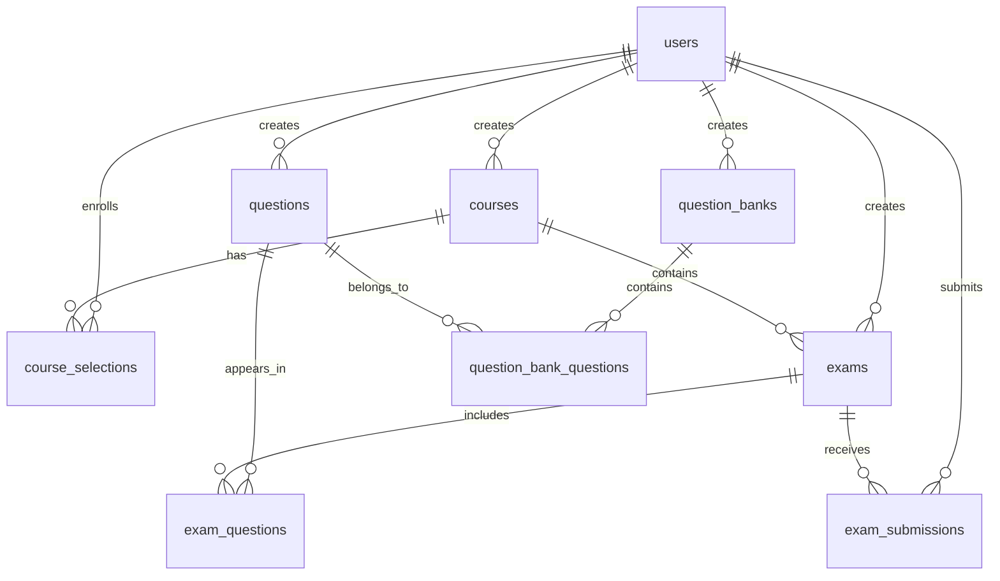

# 在线考试系统后端架构设计

## 技术栈

- **框架**: Spring Boot 4.0.0
- **语言**: Kotlin (JVM)
- **数据库**: PostgreSQL
- **ORM**: Spring Data JPA
- **API文档**: Knife4j (OpenAPI 3)
- **Java版本**: 25

## 分层架构

```
┌─────────────────────────────────────┐
│       Controller Layer              │  ← REST API 接口层
├─────────────────────────────────────┤
│       Service Layer                 │  ← 业务逻辑层
├─────────────────────────────────────┤
│       Repository Layer              │  ← 数据访问层
├─────────────────────────────────────┤
│       Entity Layer                  │  ← 实体映射层
└─────────────────────────────────────┘
           ↓
    ┌─────────────┐
    │  PostgreSQL │
    └─────────────┘
```

## 包结构设计

```
ovo.sypw.onlineexamsystem
│
├── controller           # 控制器层
│   ├── UserController
│   ├── CourseController
│   ├── QuestionController
│   ├── QuestionBankController
│   ├── ExamController
│   └── SubmissionController
│
├── service              # 服务层
│   ├── UserService
│   ├── CourseService
│   ├── QuestionService
│   ├── QuestionBankService
│   ├── ExamService
│   └── SubmissionService
│
├── repository           # 数据访问层
│   ├── UserRepository
│   ├── CourseRepository
│   ├── CourseSelectionRepository
│   ├── QuestionRepository
│   ├── QuestionBankRepository
│   ├── QuestionBankQuestionRepository
│   ├── ExamRepository
│   ├── ExamQuestionRepository
│   └── ExamSubmissionRepository
│
├── entity               # 实体类
│   ├── User
│   ├── Course
│   ├── CourseSelection
│   ├── Question
│   ├── QuestionBank
│   ├── QuestionBankQuestion
│   ├── Exam
│   ├── ExamQuestion
│   └── ExamSubmission
│
├── dto                  # 数据传输对象
│   ├── request
│   │   ├── UserRequest
│   │   ├── CourseRequest
│   │   ├── QuestionRequest
│   │   ├── ExamRequest
│   │   └── SubmissionRequest
│   └── response
│       ├── UserResponse
│       ├── CourseResponse
│       ├── QuestionResponse
│       ├── ExamResponse
│       └── SubmissionResponse
│
├── config               # 配置类
│   ├── JpaConfig
│   ├── SwaggerConfig
│   ├── WebConfig
│   ├── SecurityConfig    # JWT安全配置
│   └── FileUploadConfig  # 文件上传配置
│
├── security             # 安全模块
│   ├── JwtTokenProvider  # JWT生成和验证
│   ├── JwtAuthenticationFilter # JWT过滤器
│   └── UserDetailsServiceImpl # 用户详情服务
│
├── exception            # 异常处理
│   ├── GlobalExceptionHandler
│   ├── BusinessException
│   └── ErrorCode
│
└── util                 # 工具类
    ├── ResultUtil        # 统一响应格式
    ├── DateUtil          # 时间工具
    └── FileUtil          # 文件处理工具
```

## 核心模块设计

### 1. 用户管理模块 (User Management)

**功能**:
- 用户注册、登录
- 用户信息管理
- 角色权限管理（管理员、教师、学生）

**核心接口**:
- `POST /api/users/register` - 用户注册
- `POST /api/users/login` - 用户登录
- `GET /api/users/{id}` - 获取用户信息
- `PUT /api/users/{id}` - 更新用户信息
- `GET /api/users` - 获取用户列表（管理员）

### 2. 课程管理模块 (Course Management)

**功能**:
- 课程创建、编辑、删除（教师）
- 学生选课
- 课程列表查询

**核心接口**:
- `POST /api/courses` - 创建课程
- `GET /api/courses` - 获取课程列表
- `GET /api/courses/{id}` - 获取课程详情
- `PUT /api/courses/{id}` - 更新课程
- `DELETE /api/courses/{id}` - 删除课程
- `POST /api/courses/{id}/enroll` - 学生选课

### 3. 题库管理模块 (Question Bank Management)

**功能**:
- 题库创建、管理
- 题目创建、编辑、删除
- 题目类型支持：单选、多选、判断、填空、简答
- 题库与题目关联

**核心接口**:
- `POST /api/question-banks` - 创建题库
- `GET /api/question-banks` - 获取题库列表
- `POST /api/question-banks/{id}/questions` - 添加题目到题库
- `POST /api/questions` - 创建题目
- `GET /api/questions` - 获取题目列表
- `PUT /api/questions/{id}` - 更新题目
- `DELETE /api/questions/{id}` - 删除题目

### 4. 考试管理模块 (Exam Management)

**功能**:
- 考试创建、配置（教师）
- 选题组卷
- 考试发布、结束
- 考试时间限制

**核心接口**:
- `POST /api/exams` - 创建考试
- `GET /api/exams` - 获取考试列表
- `GET /api/exams/{id}` - 获取考试详情
- `PUT /api/exams/{id}` - 更新考试
- `POST /api/exams/{id}/publish` - 发布考试
- `POST /api/exams/{id}/questions` - 添加题目到考试

### 5. 答题评分模块 (Submission & Grading)

**功能**:
- 学生答题
- 答案提交
- 客观题自动评分
- 主观题手动评分
- 成绩查询

**核心接口**:
- `POST /api/submissions` - 提交答案
- `GET /api/submissions/exam/{examId}` - 获取考试提交记录
- `GET /api/submissions/{id}` - 获取提交详情
- `POST /api/submissions/{id}/grade` - 主观题评分
- `GET /api/submissions/user/{userId}` - 获取学生成绩

### 6. 文件上传模块 (File Upload)

**功能**:
- 图片上传（题目配图、用户头像等）
- 文件上传（题目附件、参考资料等）
- 文件存储管理
- 文件访问控制

**核心接口**:
- `POST /api/files/upload` - 上传文件
- `GET /api/files/{id}` - 下载/访问文件
- `DELETE /api/files/{id}` - 删除文件

**技术实现**:
- 文件存储：本地文件系统（可扩展为OSS）
- 支持格式：图片（jpg, png, gif）、文档（pdf, doc, docx）
- 文件大小限制：10MB

### 7. 统计分析模块 (Statistics & Analytics)

**功能**:
- 学生成绩统计（平均分、最高分、最低分）
- 考试通过率分析
- 题目正确率统计
- 课程数据分析
- 用户活跃度统计

**核心接口**:
- `GET /api/statistics/exam/{examId}` - 考试统计数据
- `GET /api/statistics/course/{courseId}` - 课程统计数据
- `GET /api/statistics/question/{questionId}` - 题目统计数据
- `GET /api/statistics/student/{studentId}` - 学生成绩分析
- `GET /api/statistics/overview` - 系统总览（管理员）

### 8. JWT认证模块 (JWT Authentication)

**功能**:
- 用户登录认证
- Token生成与验证
- Token刷新机制
- 权限控制

**核心接口**:
- `POST /api/auth/login` - 用户登录（返回Token）
- `POST /api/auth/refresh` - 刷新Token
- `POST /api/auth/logout` - 退出登录
- `GET /api/auth/me` - 获取当前用户信息

**Token配置**:
- 访问Token有效期：2小时
- 刷新Token有效期：7天
- 密钥：配置文件中设置

## 统一响应格式

```kotlin
data class Result<T>(
    val code: Int,          // 状态码
    val message: String,    // 消息
    val data: T?            // 数据
)
```

**示例**:
```json
{
  "code": 200,
  "message": "success",
  "data": { ... }
}
```

## 实体关系图



## 安全设计

### 认证与授权
- **认证方式**: JWT Token
- **密码加密**: BCrypt
- **权限控制**: 基于角色的访问控制（RBAC）
- **Token存储**: 客户端（LocalStorage/SessionStorage）
- **CORS配置**: 配置允许的跨域源

### 角色权限

| 角色 | 权限 |
|------|------|
| **admin** | 系统管理、用户管理 |
| **teacher** | 课程管理、题库管理、考试管理、评分 |
| **student** | 选课、参加考试、查看成绩 |

## 数据验证

- 使用 Bean Validation (Jakarta Validation) 进行参数校验
- 自定义校验注解
- 全局异常处理

## 日志记录

- 使用 SLF4J + Logback
- 关键操作记录（考试提交、评分等）
- 异常日志记录

## 用户审核要点

> [!IMPORTANT]
> **请确认以下设计要点**:
> 
> 1. **分层架构**是否符合项目需求？
> 2. **包结构**是否清晰合理？
> 3. **核心模块**的功能划分是否合适？
> 4. **API接口**设计是否满足业务需求？
> 5. 是否需要添加其他模块（如：文件上传、统计分析等）？
> 6. 是否需要实现JWT认证？
