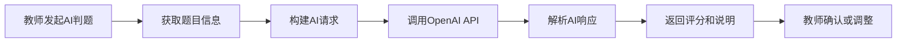
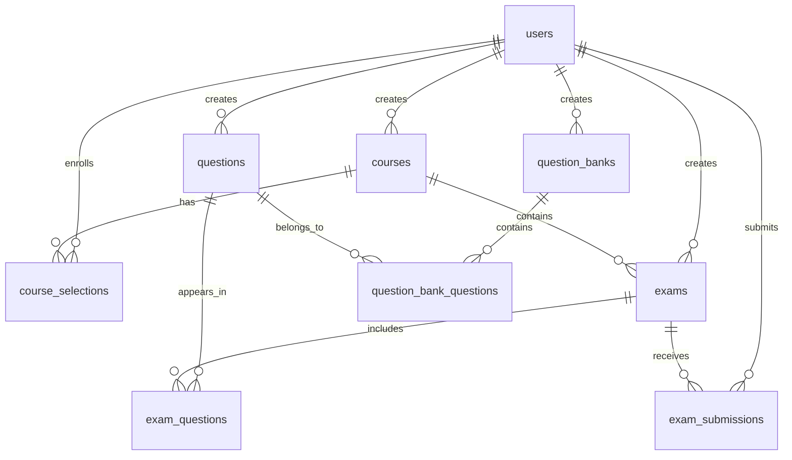

# 在线考试系统后端架构设计

## 技术栈

- **框架**: Spring Boot 4.0.0
- **语言**: Kotlin (JVM)
- **数据库**: PostgreSQL
- **ORM**: Spring Data JPA
- **Java版本**: 24

## 分层架构

```
┌─────────────────────────────────────┐
│       Controller Layer              │  ← REST API 接口层
├─────────────────────────────────────┤
│       Service Layer                 │  ← 业务逻辑层
├─────────────────────────────────────┤
│       Repository Layer              │  ← 数据访问层
├─────────────────────────────────────┤
│       Entity Layer                  │  ← 实体映射层
└─────────────────────────────────────┘
           ↓
    ┌─────────────┐
    │  PostgreSQL │
    └─────────────┘
```

## 包结构设计

```
ovo.sypw.onlineexamsystem
│
├── controller           # 控制器层
│   ├── UserController
│   ├── CourseController
│   ├── QuestionController
│   ├── QuestionBankController
│   ├── ExamController
│   ├── SubmissionController
│   ├── FileController
│   ├── StatisticsController
│   ├── AiGradingController
│   ├── NotificationController
│   ├── ScheduleController
│   └── QuestionImportExportController
│
├── service              # 服务层
│   ├── UserService
│   ├── CourseService
│   ├── QuestionService
│   ├── QuestionBankService
│   ├── ExamService
│   ├── SubmissionService
│   ├── FileService
│   ├── StatisticsService
│   ├── AiGradingService
│   ├── NotificationService
│   ├── ScheduleService
│   └── QuestionImportExportService
│
├── repository           # 数据访问层
│   ├── UserRepository
│   ├── CourseRepository
│   ├── CourseSelectionRepository
│   ├── QuestionRepository
│   ├── QuestionBankRepository
│   ├── QuestionBankQuestionRepository
│   ├── ExamRepository
│   ├── ExamQuestionRepository
│   ├── ExamSubmissionRepository
│   ├── AiConfigRepository
│   ├── NotificationRepository
│   └── ImportTaskRepository
│
├── entity               # 实体类
│   ├── User
│   ├── Course
│   ├── CourseSelection
│   ├── Question
│   ├── QuestionBank
│   ├── QuestionBankQuestion
│   ├── Exam
│   ├── ExamQuestion
│   ├── ExamSubmission
│   ├── AiConfig
│   ├── Notification
│   └── ImportTask
│
├── dto                  # 数据传输对象
│   ├── request
│   │   ├── UserRequest
│   │   ├── CourseRequest
│   │   ├── QuestionRequest
│   │   ├── ExamRequest
│   │   └── SubmissionRequest
│   └── response
│       ├── UserResponse
│       ├── CourseResponse
│       ├── QuestionResponse
│       ├── ExamResponse
│       └── SubmissionResponse
│
├── config               # 配置类
│   ├── JpaConfig
│   ├── SwaggerConfig
│   ├── WebConfig
│   ├── SecurityConfig    # JWT安全配置
│   ├── FileUploadConfig  # 文件上传配置
│   ├── BosConfig         # 百度云BOS配置
│   └── OpenAIConfig      # OpenAI API配置
│
├── security             # 安全模块
│   ├── JwtTokenProvider  # JWT生成和验证
│   ├── JwtAuthenticationFilter # JWT过滤器
│   └── UserDetailsServiceImpl # 用户详情服务
│
├── exception            # 异常处理
│   ├── GlobalExceptionHandler
│   ├── BusinessException
│   └── ErrorCode
│
└── util                 # 工具类
    ├── ResultUtil        # 统一响应格式
    ├── DateUtil          # 时间工具
    └── FileUtil          # 文件处理工具
```

## 核心模块设计

### 1. 用户管理模块 (User Management)

**功能**:
- 用户注册、登录
- 用户信息管理
- 角色权限管理（管理员、教师、学生）

**核心接口**:
- `POST /api/users/register` - 用户注册
- `POST /api/users/login` - 用户登录
- `GET /api/users/{id}` - 获取用户信息
- `PUT /api/users/{id}` - 更新用户信息
- `GET /api/users` - 获取用户列表（管理员）

### 2. 课程管理模块 (Course Management)

**功能**:
- 课程创建、编辑、删除（教师）
- 学生选课
- 课程列表查询

**核心接口**:
- `POST /api/courses` - 创建课程
- `GET /api/courses` - 获取课程列表
- `GET /api/courses/{id}` - 获取课程详情
- `PUT /api/courses/{id}` - 更新课程
- `DELETE /api/courses/{id}` - 删除课程
- `POST /api/courses/{id}/enroll` - 学生选课

### 3. 题库管理模块 (Question Bank Management)

**功能**:
- 题库创建、管理
- 题目创建、编辑、删除
- 题目类型支持：单选、多选、判断、填空、简答
- 题库与题目关联

**核心接口**:
- `POST /api/question-banks` - 创建题库
- `GET /api/question-banks` - 获取题库列表
- `POST /api/question-banks/{id}/questions` - 添加题目到题库
- `POST /api/questions` - 创建题目
- `GET /api/questions` - 获取题目列表
- `PUT /api/questions/{id}` - 更新题目
- `DELETE /api/questions/{id}` - 删除题目

### 4. 考试管理模块 (Exam Management)

**功能**:
- 考试创建、配置（教师）
- 选题组卷
- 考试发布、结束
- 考试时间限制

**核心接口**:
- `POST /api/exams` - 创建考试
- `GET /api/exams` - 获取考试列表
- `GET /api/exams/{id}` - 获取考试详情
- `PUT /api/exams/{id}` - 更新考试
- `POST /api/exams/{id}/publish` - 发布考试
- `POST /api/exams/{id}/questions` - 添加题目到考试

### 5. 答题评分模块 (Submission & Grading)

**功能**:
- 学生答题
- 答案提交
- 客观题自动评分
- 主观题手动评分
- 成绩查询

**核心接口**:
- `POST /api/submissions` - 提交答案
- `GET /api/submissions/exam/{examId}` - 获取考试提交记录
- `GET /api/submissions/{id}` - 获取提交详情
- `POST /api/submissions/{id}/grade` - 主观题评分
- `GET /api/submissions/user/{userId}` - 获取学生成绩

### 6. 文件上传模块 (File Upload)

**功能**:
- 图片上传（题目配图、用户头像等）
- 文件上传（题目附件、参考资料等）
- 文件存储管理
- 文件访问控制

**核心接口**:
- `POST /api/files/upload` - 上传文件
- `GET /api/files/{id}` - 下载/访问文件
- `DELETE /api/files/{id}` - 删除文件

**技术实现**:
- 文件存储：本地文件系统（可扩展为OSS）
- 支持格式：图片（jpg, png, gif）、文档（pdf, doc, docx）
- 文件大小限制：10MB

### 7. 统计分析模块 (Statistics & Analytics)

**功能**:
- 学生成绩统计（平均分、最高分、最低分）
- 考试通过率分析
- 题目正确率统计
- 课程数据分析
- 用户活跃度统计

**核心接口**:
- `GET /api/statistics/exam/{examId}` - 考试统计数据
- `GET /api/statistics/course/{courseId}` - 课程统计数据
- `GET /api/statistics/question/{questionId}` - 题目统计数据
- `GET /api/statistics/student/{studentId}` - 学生成绩分析
- `GET /api/statistics/overview` - 系统总览（管理员）

### 8. AI辅助判题模块 (AI-Assisted Grading)

**功能**:
- 使用AI大模型辅助批改主观题
- 基于题目内容、参考答案、学生答案进行智能判分
- 提供详细的评分依据和建议
- 支持多种AI模型（OpenAI GPT系列等）
- 管理员可配置AI模型参数

**核心接口**:
- `POST /api/ai-grading/grade` - AI辅助判题
- `GET /api/ai-grading/config` - 获取AI配置（管理员）
- `PUT /api/ai-grading/config` - 更新AI配置（管理员）

**技术实现**:
- **AI服务提供商**: OpenAI API
- **支持模型**: GPT-4, GPT-3.5-turbo等
- **请求格式**: JSON格式，包含题目、参考答案、学生答案
- **数据存储**: ai_config表存储系统提示词、模型配置等

**判题流程**:


**AI请求示例**:
```json
{
  "questionId": 123,
  "questionContent": "请简述Java多态的概念和应用场景",
  "referenceAnswer": "多态是指同一个接口可以有多种实现...",
  "studentAnswer": "多态就是一个方法可以有多种形式..."
}
```

**AI响应示例**:
```json
{
  "suggestedScore": 7,
  "maxScore": 10,
  "explanation": "学生理解了多态的基本概念，但缺少具体应用场景的描述...",
  "strengths": ["理解基本概念", "表述清晰"],
  "improvements": ["需补充应用场景", "可以举例说明"]
}
```

**AI配置管理**:
- 系统提示词（System Prompt）：定义AI判题的评分标准和行为
- 模型选择：GPT-4 / GPT-3.5-turbo等
- 温度参数（Temperature）：控制AI输出的随机性
- 最大Token数：限制响应长度

**数据表设计**:
```sql
CREATE TABLE ai_config (
    id BIGSERIAL PRIMARY KEY,
    config_key VARCHAR(100) NOT NULL UNIQUE,
    config_value TEXT,
    description VARCHAR(255),
    updated_by BIGINT REFERENCES users(id),
    update_time TIMESTAMP DEFAULT CURRENT_TIMESTAMP
);

-- 预设配置
INSERT INTO ai_config (config_key, config_value, description) VALUES
('system_prompt', '你是一个专业的教师助手...', 'AI判题系统提示词'),
('model_name', 'gpt-3.5-turbo', '使用的AI模型'),
('temperature', '0.3', '模型温度参数'),
('max_tokens', '500', '最大响应Token数');
```

### 9. 通知系统模块 (Notification System)

**功能**:
- 系统消息通知（考试发布、成绩发布等）
- 个人消息管理
- 未读消息提醒
- 消息已读/未读状态
- 消息删除

**核心接口**:
- `GET /api/notifications` - 获取通知列表
- `GET /api/notifications/unread-count` - 未读消息数量
- `PUT /api/notifications/{id}/read` - 标记为已读
- `PUT /api/notifications/read-all` - 全部标记为已读
- `DELETE /api/notifications/{id}` - 删除通知

**通知类型**:
- **EXAM_PUBLISHED**: 考试发布通知
- **EXAM_REMINDER**: 考试提醒（考前24小时、1小时）
- **GRADE_RELEASED**: 成绩发布通知
- **COURSE_UPDATE**: 课程更新通知
- **SYSTEM_ANNOUNCEMENT**: 系统公告

**数据表设计**:
```sql
CREATE TABLE notifications (
    id BIGSERIAL PRIMARY KEY,
    user_id BIGINT NOT NULL REFERENCES users(id),
    type VARCHAR(50) NOT NULL,
    title VARCHAR(200) NOT NULL,
    content TEXT,
    related_id BIGINT,          -- 关联的考试/课程ID
    is_read BOOLEAN DEFAULT false,
    create_time TIMESTAMP DEFAULT CURRENT_TIMESTAMP
);

CREATE INDEX idx_notifications_user_id ON notifications(user_id);
CREATE INDEX idx_notifications_is_read ON notifications(user_id, is_read);
```

**自动通知触发**:
- 考试发布时 → 向选课学生发送通知
- 成绩发布时 → 向考生发送通知
- 考前24小时 → 定时任务发送提醒
- 考前1小时 → 定时任务发送提醒

---

### 10. 考试日程管理 (Exam Scheduling)

**功能**:
- 我的考试日程列表
- 日历视图展示
- 考试状态分类（即将开始、进行中、已结束）
- 考试倒计时
- 即将到来的考试提醒

**核心接口**:
- `GET /api/schedule/my-exams` - 我的考试日程
- `GET /api/schedule/calendar` - 月度日历数据
- `GET /api/schedule/upcoming` - 即将到来的考试（未来7天）
- `GET /api/schedule/{examId}/countdown` - 考试倒计时

**日程状态**:
```kotlin
enum class ExamScheduleStatus {
    UPCOMING,       // 即将开始（未开始）
    IN_PROGRESS,    // 进行中
    COMPLETED,      // 已结束（未提交）
    SUBMITTED       // 已提交
}
```

**响应数据结构**:
```json
{
  "examId": 1,
  "examTitle": "Java期中考试",
  "courseName": "Java程序设计",
  "startTime": "2024-12-01 10:00:00",
  "endTime": "2024-12-01 12:00:00",
  "duration": 120,
  "status": "UPCOMING",
  "countdown": "距离开始还有2小时30分",
  "isSubmitted": false
}
```

**日历视图数据**:
```json
{
  "year": 2024,
  "month": 12,
  "days": [
    {
      "date": "2024-12-01",
      "exams": [
        {"examId": 1, "title": "Java期中", "startTime": "10:00"}
      ]
    }
  ]
}
```

**前端展示**:
- 时间轴视图（按时间排序）
- 日历视图（月度/周度）
- 状态筛选（全部/进行中/即将开始）
- 倒计时实时更新

---

### 11. 题目导入导出 (Question Import/Export)

**功能**:
- Excel批量导入题目
- Word文档导入
- 题库导出（Excel格式）
- 导入模板下载
- 导入结果验证与错误报告

**核心接口**:
- `POST /api/questions/import` - 导入题目（Multipart）
- `GET /api/questions/export?bankId={id}` - 导出题库
- `GET /api/questions/template` - 下载导入模板
- `GET /api/questions/import-result/{taskId}` - 查询导入结果

**Excel导入格式**:
| 列名 | 说明 | 示例 |
|------|------|------|
| 题型 | single/multiple/true_false/fill_blank/short_answer | single |
| 题目内容 | 题目描述 | Java是什么类型的语言？ |
| 选项A | 单选/多选题的选项 | 编译型语言 |
| 选项B | 单选/多选题的选项 | 解释型语言 |
| 选项C | 单选/多选题的选项 | 混合型语言 |
| 选项D | 单选/多选题的选项 | 标记语言 |
| 正确答案 | 答案（单选:A, 多选:A,C） | C |
| 解析 | 题目解析 | Java是编译+解释的... |
| 难度 | easy/medium/hard | medium |
| 标签 | 知识点标签（逗号分隔） | Java基础,语言特性 |

**技术实现**:
- **Excel处理**: Apache POI (XSSF)
- **数据验证**: 
  - 题型有效性检查
  - 答案格式验证
  - 必填字段检查
  - 选项完整性验证

**导入流程**:
```
上传文件
    ↓
解析Excel/Word
    ↓
数据验证
    ↓
批量插入数据库
    ↓
返回导入结果
    ├─ 成功数量
    ├─ 失败数量
    └─ 错误详情（第X行：错误原因）
```

**导入结果响应**:
```json
{
  "taskId": "uuid",
  "totalRows": 100,
  "successCount": 95,
  "failedCount": 5,
  "errors": [
    {"row": 3, "reason": "题型无效: singlee"},
    {"row": 15, "reason": "缺少必填字段: 题目内容"},
    {"row": 28, "reason": "单选题必须有4个选项"}
  ]
}
```

**导出功能**:
- 支持按题库导出
- 支持按题型筛选导出
- 支持按难度筛选导出
- Excel格式，包含所有题目信息

**依赖库**:
```gradle
implementation("org.apache.poi:poi-ooxml:5.2.5")
implementation("org.apache.poi:poi:5.2.5")
```

---

### 12. JWT认证模块 (JWT Authentication)

**功能**:
- 用户登录认证
- Token生成与验证
- Token刷新机制
- 权限控制

**核心接口**:
- `POST /api/auth/login` - 用户登录（返回Token）
- `POST /api/auth/refresh` - 刷新Token
- `POST /api/auth/logout` - 退出登录
- `GET /api/auth/me` - 获取当前用户信息

**Token配置**:
- 访问Token有效期：2小时
- 刷新Token有效期：7天
- 密钥：配置文件中设置

## 统一响应格式

```kotlin
data class Result<T>(
    val code: Int,          // 状态码
    val message: String,    // 消息
    val data: T?            // 数据
)
```

**示例**:
```json
{
  "code": 200,
  "message": "success",
  "data": { ... }
}
```

## 实体关系图



## 安全设计

### 认证与授权
- **认证方式**: JWT Token
- **密码加密**: BCrypt
- **权限控制**: 基于角色的访问控制（RBAC）
- **Token存储**: 客户端（LocalStorage/SessionStorage）
- **CORS配置**: 配置允许的跨域源

### 角色权限

| 角色 | 权限 |
|------|------|
| **admin** | 系统管理、用户管理 |
| **teacher** | 课程管理、题库管理、考试管理、评分 |
| **student** | 选课、参加考试、查看成绩 |

## 数据验证

- 使用 Bean Validation (Jakarta Validation) 进行参数校验
- 自定义校验注解
- 全局异常处理

## 日志记录

- 使用 SLF4J + Logback
- 关键操作记录（考试提交、评分等）
- 异常日志记录

## 用户审核要点

> [!IMPORTANT]
> **请确认以下设计要点**:
> 
> 1. **分层架构**是否符合项目需求？
> 2. **包结构**是否清晰合理？
> 3. **核心模块**的功能划分是否合适？
> 4. **API接口**设计是否满足业务需求？
> 5. 是否需要添加其他模块（如：文件上传、统计分析等）？
> 6. 是否需要实现JWT认证？
